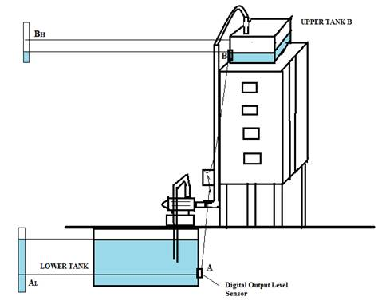
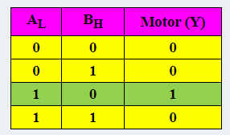
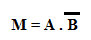
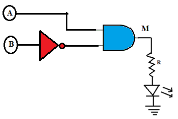

1 INTRODUCTION

Many industrial and domestic applications use the basic AND & NOT gates to either indicate or control operations such as turning ON/OFF of alarms, indicators, digitally controlled tank valves, heaters, motors, machines very efficiently. Industries and multi-storeyed buildings, bungalows need a circuit that could control the motor ON/OFF status automatically.

 1.1 APPLICATION: WATER LEVEL CONTROLLER

Consider the case of a water level controller system installed in a multi-storeyed apartment. Practically you may design a circuit with multiple sensors that indicate the low and high levels of each tank. Though the design complexity increases with the additional number of sensors involved, the system performance turns out to be robust to handle a variety of water level combinations. But for simplicity, let us consider only two level sensors A & B with digital outputs; located in the lower tank and the upper tank respectively.

1.2 CONCEPT: The motor should turn ON only when the lower tank is full and the upper tank is empty and for all other conditions the motor should be OFF.

The concept diagram is as shown in Fig.1. The truth table corresponding to the concept & its circuit diagram are shown in Table 1 and Fig.2 respectively.

 TRUTH TABLE

  

By looking at the truth table, the Boolean expression defining this control operation is given by: 

